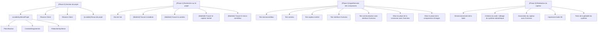

```mermaid
graph TD
    LivrableSyntheseProjet --> Plannification
    LivrableSyntheseProjet --> CreationDiagrammes
    LivrableSyntheseProjet --> RedactionSynthese

    Phase0["[Phase 0] Gestion de projet"]
    ReunionClient1["Réunion Client"]
    ReunionClient2["Réunion Client"]
    LivrableRevue["[Livrable] Revue de projet"]

    Phase0 --> ReunionClient1
    Phase0 --> ReunionClient2
    Phase0 --> LivrableSyntheseProjet
    Phase0 --> LivrableRevue

    Phase1["[Phase 1] Recherche sur le projet"]
    EtatArt["Etat de l'art"]
    TrouverBatterie["[Matériel] Trouver la batterie"]
    TrouverCamera["[Matériel] Trouver la caméra"]
    TrouverCapteur["[Matériel] Trouver le capteur inertiel"]
    TrouverMicrocontroleur["[Matériel] Trouver le micro-contrôleur"]

    Phase1 --> EtatArt
    Phase1 --> TrouverBatterie
    Phase1 --> TrouverCamera
    Phase1 --> TrouverCapteur
    Phase1 --> TrouverMicrocontroleur

    Phase2["[Phase 2] Appréhension des composants"]
    TestMicro["Test microcontrôleur"]
    TestCam["Test caméra"]
    TestCapteur["Test capteur inertiel"]
    TestInt["Test interface Overview"]
    TestComm["Test communication avec interface Overview"]
    Connexion["Mise en place de la connexion avec Overview"]
    Compression["Mise en place de la compression d'images"]

    Phase2 --> TestMicro
    Phase2 --> TestCam
    Phase2 --> TestCapteur
    Phase2 --> TestInt
    Phase2 --> TestComm
    Phase2 --> Connexion
    Phase2 --> Compression

    Phase3["[Phase 3] Réalisation du capteur"]
    Boite["Dimensionnement de la boite"]
    Codage["Création du code / câblage du système odométrique"]
    AssocCapteur["Association du capteur avec Overview"]
    Impression["Impression boite 3D"]
    TestsGlobalite["Tests de la globalité du système"]

    Phase3 --> Boite
    Phase3 --> Codage
    Phase3 --> AssocCapteur
    Phase3 --> Impression
    Phase3 --> TestsGlobalite
```