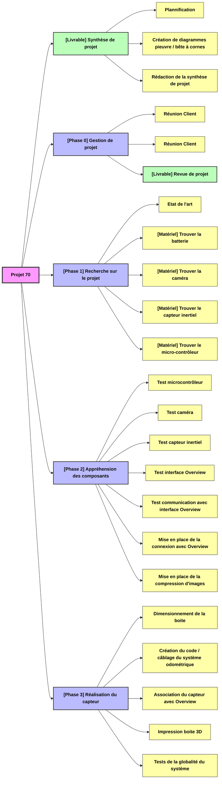

<<<<<<< HEAD

=======
| Supported Targets | ESP32 | ESP32-C2 | ESP32-C3 | ESP32-C5 | ESP32-C6 | ESP32-C61 | ESP32-H2 | ESP32-H21 | ESP32-H4 | ESP32-P4 | ESP32-S2 | ESP32-S3 | Linux |
| ----------------- | ----- | -------- | -------- | -------- | -------- | --------- | -------- | --------- | -------- | -------- | -------- | -------- | ----- |

# Hello World Example

Starts a FreeRTOS task to print "Hello World".

(See the README.md file in the upper level 'examples' directory for more information about examples.)

## How to use example

Follow detailed instructions provided specifically for this example.

Select the instructions depending on Espressif chip installed on your development board:

- [ESP32 Getting Started Guide](https://docs.espressif.com/projects/esp-idf/en/stable/get-started/index.html)
- [ESP32-S2 Getting Started Guide](https://docs.espressif.com/projects/esp-idf/en/latest/esp32s2/get-started/index.html)


## Example folder contents

The project **hello_world** contains one source file in C language [hello_world_main.c](main/hello_world_main.c). The file is located in folder [main](main).

ESP-IDF projects are built using CMake. The project build configuration is contained in `CMakeLists.txt` files that provide set of directives and instructions describing the project's source files and targets (executable, library, or both).

Below is short explanation of remaining files in the project folder.

```
├── CMakeLists.txt
├── pytest_hello_world.py      Python script used for automated testing
├── main
│   ├── CMakeLists.txt
│   └── hello_world_main.c
└── README.md                  This is the file you are currently reading
```

For more information on structure and contents of ESP-IDF projects, please refer to Section [Build System](https://docs.espressif.com/projects/esp-idf/en/latest/esp32/api-guides/build-system.html) of the ESP-IDF Programming Guide.

## Troubleshooting

* Program upload failure

    * Hardware connection is not correct: run `idf.py -p PORT monitor`, and reboot your board to see if there are any output logs.
    * The baud rate for downloading is too high: lower your baud rate in the `menuconfig` menu, and try again.

## Technical support and feedback

Please use the following feedback channels:

* For technical queries, go to the [esp32.com](https://esp32.com/) forum
* For a feature request or bug report, create a [GitHub issue](https://github.com/espressif/esp-idf/issues)

We will get back to you as soon as possible.
>>>>>>> origin/master
